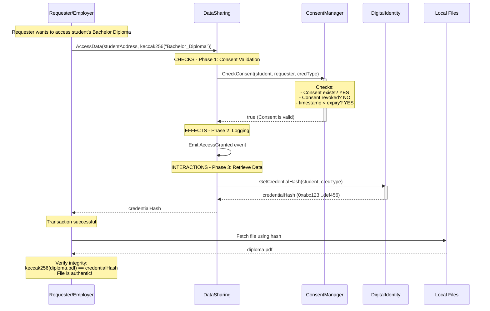
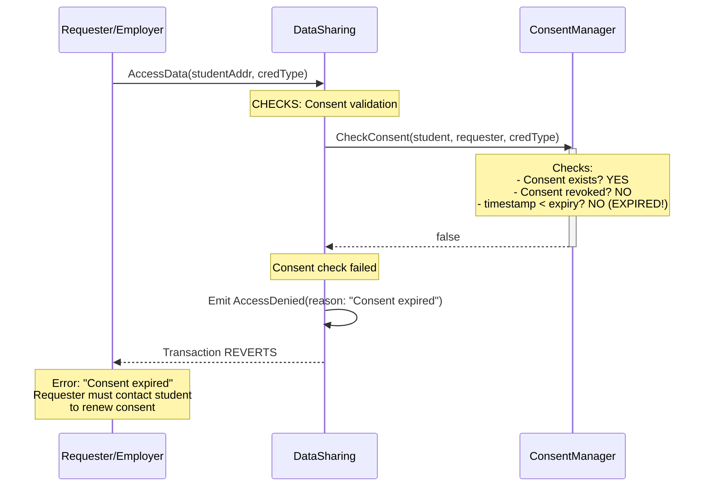
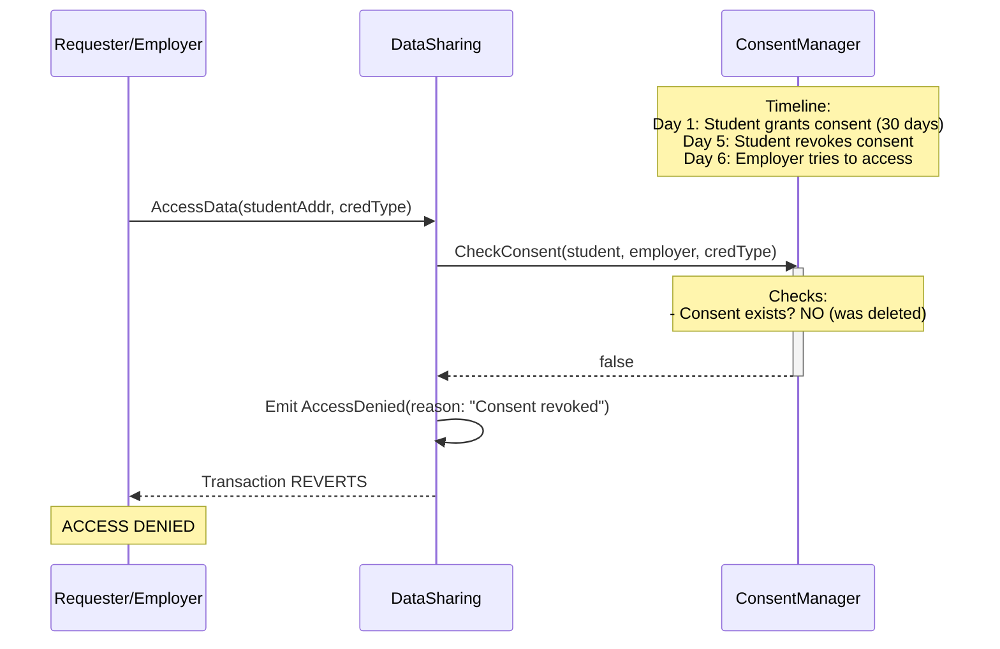
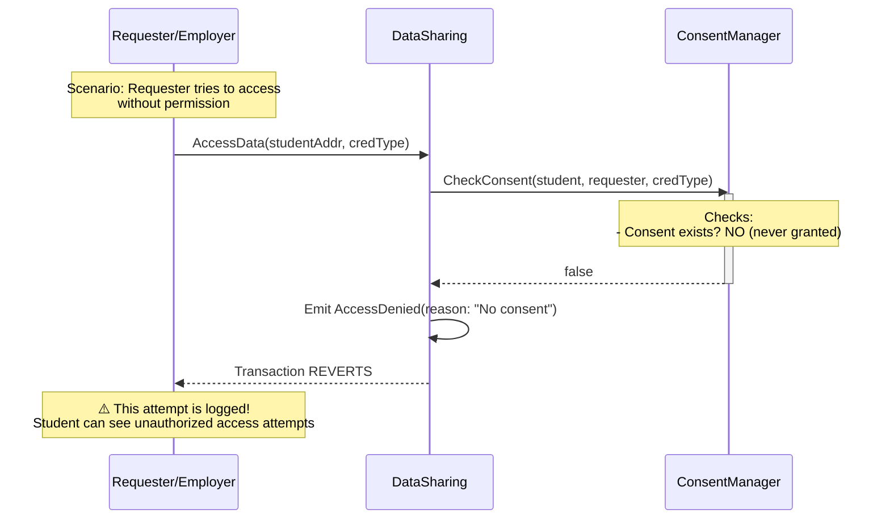
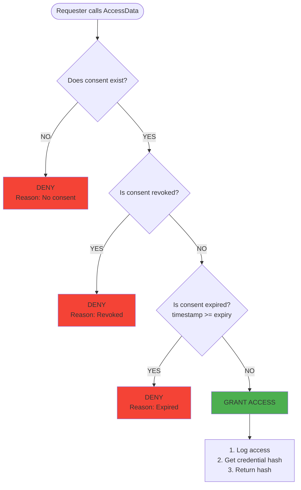
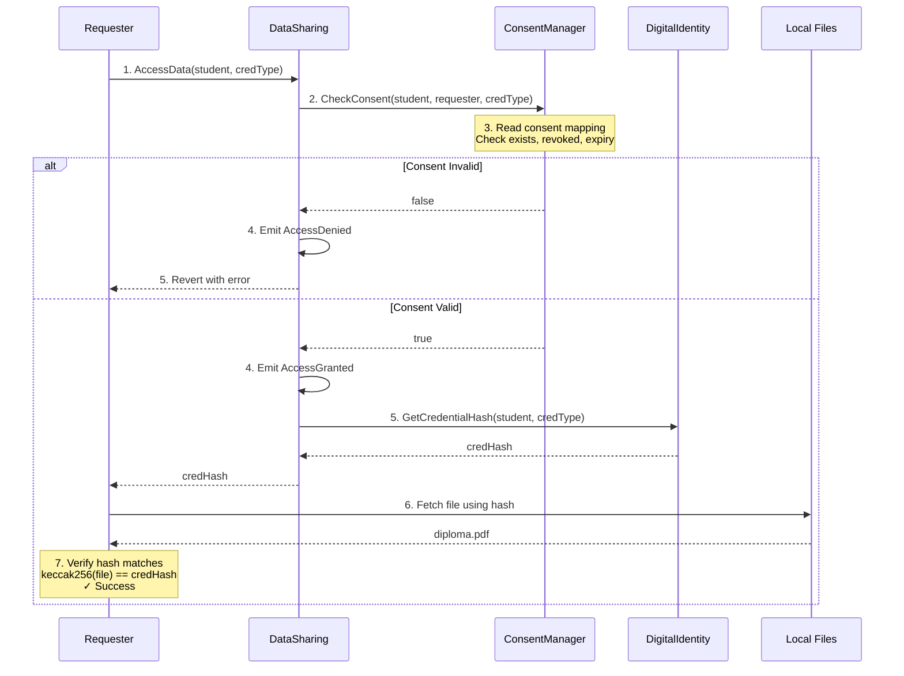
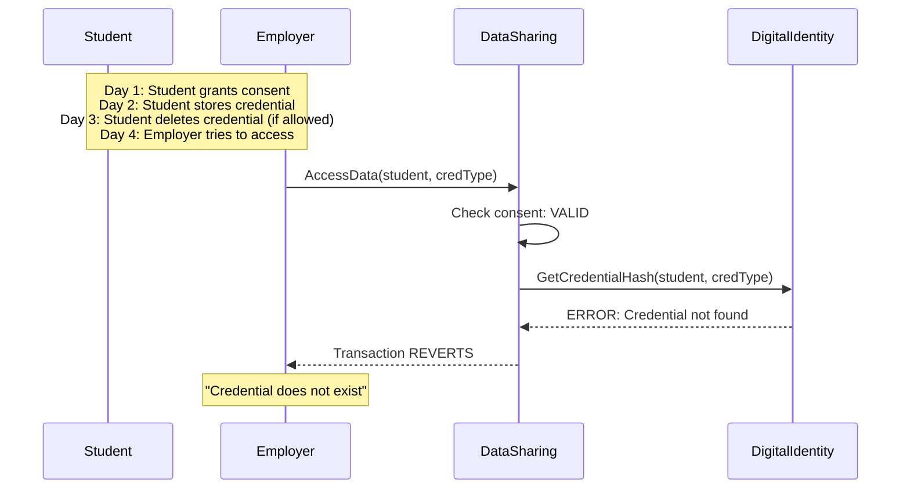
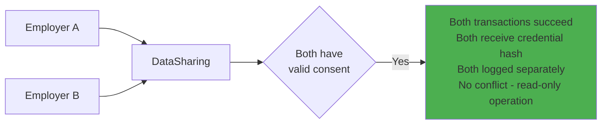
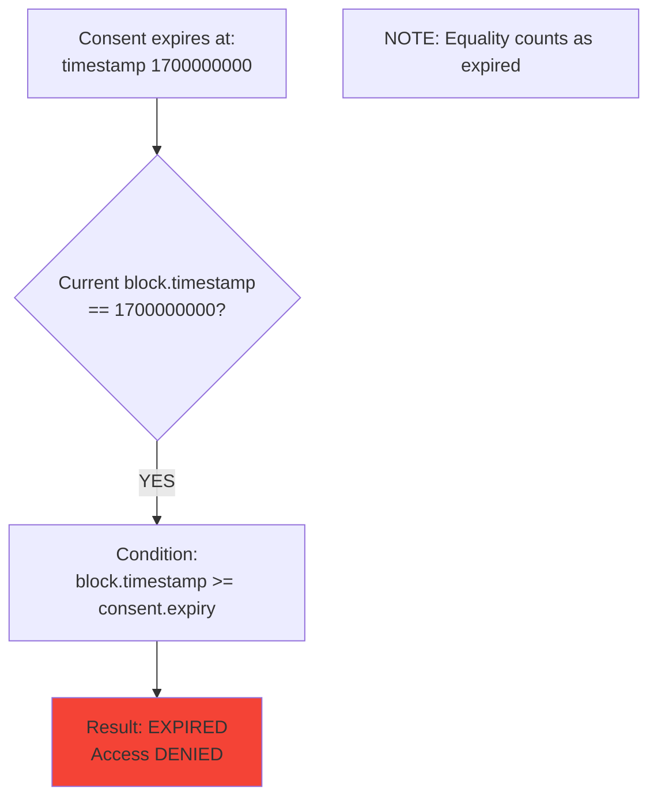

# Data Access Workflow Diagrams

## 1. Successful Access (Valid Consent)



---

## 2. Access Denied - Expired Consent



---

## 3. Access Denied - Revoked Consent



---

## 4. Access Denied - No Consent Ever Granted



---

## 5. Decision Tree: Access Control Logic



---

## 6. Complete Access Flow Sequence



---

## 7. Access Logging (Audit Trail)

### Event Structure

```solidity
event AccessGranted(
    address indexed owner,       // Student who owns credential
    address indexed requester,   // Employer who accessed
    bytes32 indexed credentialTypeHash,
    bytes32 credentialHash,      // Hash returned
    uint256 timestamp            // When accessed
);

event AccessDenied(
    address indexed owner,
    address indexed requester,
    bytes32 indexed credentialTypeHash,
    string reason,               // "Expired", "Revoked", "No consent"
    uint256 timestamp
);
```

---

## 8. Querying Audit Logs

### Student's Perspective: "Who accessed my credentials?"

```javascript
// Using Viem.js or Ethers.js

// Get all successful accesses
const accessGrantedLogs = await contract.queryFilter(
  contract.filters.AccessGranted(studentAddress, null, null)
);

// Get all denied attempts
const accessDeniedLogs = await contract.queryFilter(
  contract.filters.AccessDenied(studentAddress, null, null)
);

// Results:
[
  {
    owner: "0xStudent...",
    requester: "0xEmployerA...",
    credentialType: "0xBachelorDiploma...",
    timestamp: 1700000000,
    status: "GRANTED"
  },
  {
    owner: "0xStudent...",
    requester: "0xEmployerB...",
    credentialType: "0xTranscript...",
    reason: "No consent",
    timestamp: 1700001000,
    status: "DENIED"
  }
]
```

---

### Requester's Perspective: "What credentials did I access?"

```javascript
// Get all my access attempts
const myAccessLogs = await contract.queryFilter(
  contract.filters.AccessGranted(null, requesterAddress, null)
);

// Results:
[
  {
    owner: "0xStudent1...",
    requester: "0xMyAddress...",
    credentialType: "0xBachelorDiploma...",
    credentialHash: "0xabc123...",
    timestamp: 1700000000
  },
  {
    owner: "0xStudent2...",
    requester: "0xMyAddress...",
    credentialType: "0xMasterDegree...",
    credentialHash: "0xdef456...",
    timestamp: 1700002000
  }
]
```

---

## 9. Security Considerations

### Authorization
- Only requester with valid consent can access
- Consent tied to specific requester address (no impersonation)
- Consent tied to specific credential type (granular control)

### Time-Based Access Control
- Automatic expiration (no cron jobs needed)
- Checked on-demand (gas-efficient)
- No grace period (strict expiry)

### Audit Trail
- Every access logged (success and failure)
- Logs are immutable (events on blockchain)
- Students can detect unauthorized attempts
- Compliance-ready (GDPR, HIPAA principles)

### Data Privacy
- Only hash returned on-chain
- Actual file stored off-chain
- Hash verification prevents tampering

---

## 10. Edge Cases

### Case 1: Credential Deleted After Consent Granted



**Mitigation**: Don't allow credential deletion, only updates.

---

### Case 2: Simultaneous Access from Multiple Requesters



**No issue**: Read operations don't conflict.

---

### Case 3: Access During Block of Expiry



---

## 11. Performance & Gas Costs

| Operation | Estimated Gas | Notes |
|-----------|---------------|-------|
| AccessData (success) | ~50,000 | 1 consent check + 1 storage read + 1 event |
| AccessData (denied) | ~30,000 | 1 consent check + 1 event (revert) |
| Event emission | ~1,500 | Per AccessGranted/AccessDenied event |
| ConsentManager.CheckConsent | ~5,000 | 3 storage reads (exists, revoked, expiry) |
| DigitalIdentity.GetCredentialHash | ~3,000 | 1 storage read |

**Optimization**: Use events instead of storage array for logs (saves ~20,000 gas per access).

---

## Summary: Access Workflow Key Points

**Successful Access**:
1. Check consent (valid, not expired, not revoked)
2. Log access (emit AccessGranted event)
3. Retrieve credential hash from DigitalIdentity
4. Return hash to requester
5. Requester fetches file off-chain
6. Requester verifies hash matches file

**Failed Access**:
- Consent expired → AccessDenied("expired")
- Consent revoked → AccessDenied("revoked")
- No consent → AccessDenied("no consent")
- All failures are logged (immutable audit trail)

**Security**:
- Checks-Effects-Interactions pattern
- Consent check BEFORE data retrieval
- All attempts logged (success and failure)
- No data returned on failure

**Privacy**:
- Only hash returned (not actual credential)
- Off-chain file verification
- Hash tampering detectable