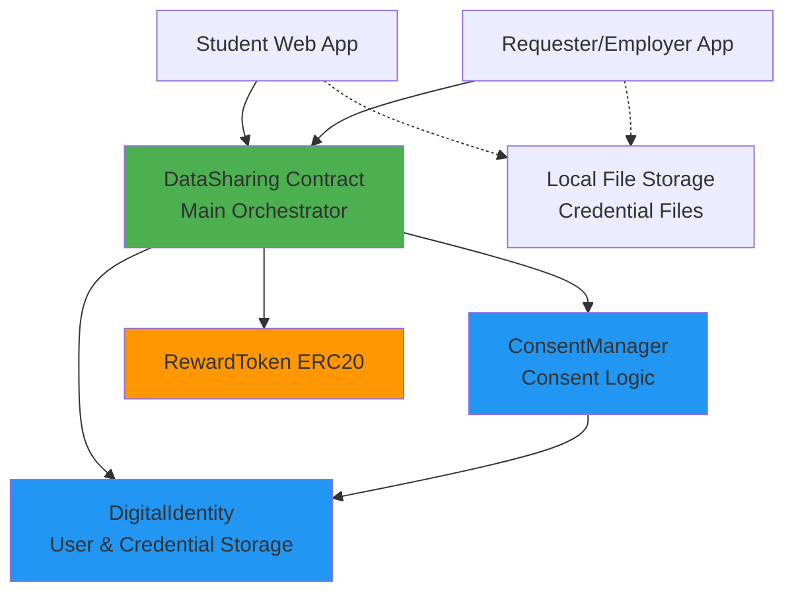
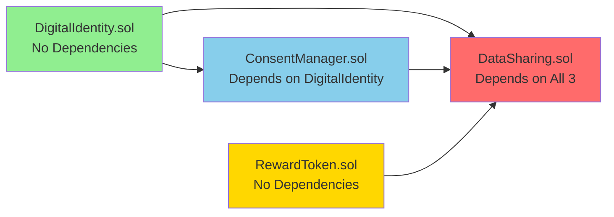
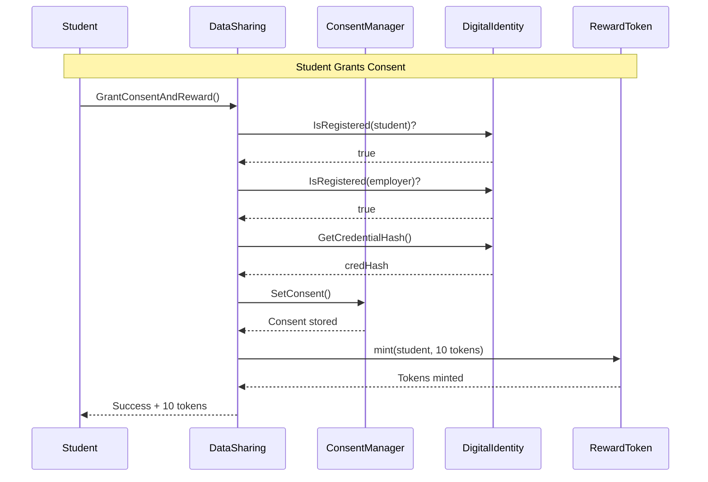
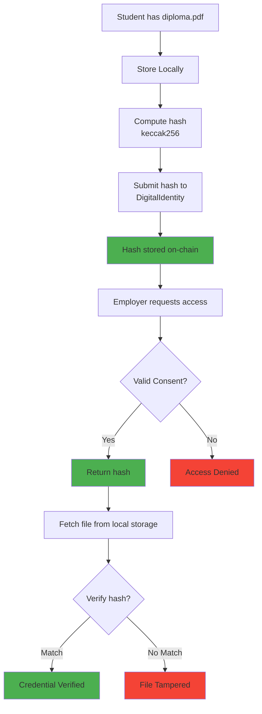
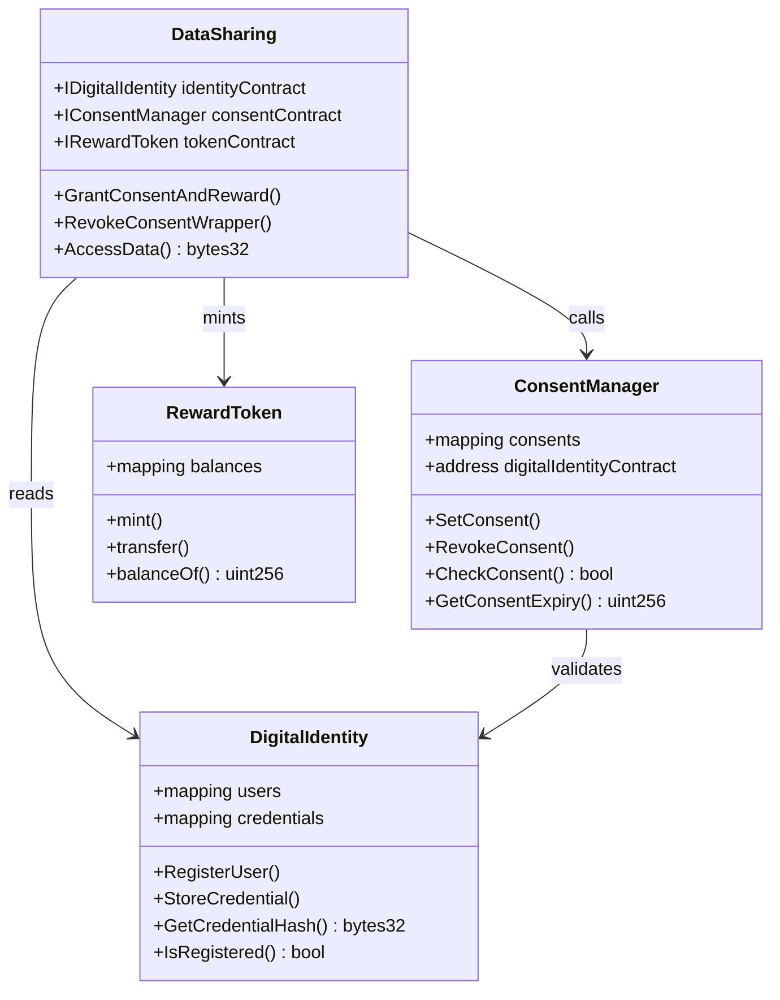
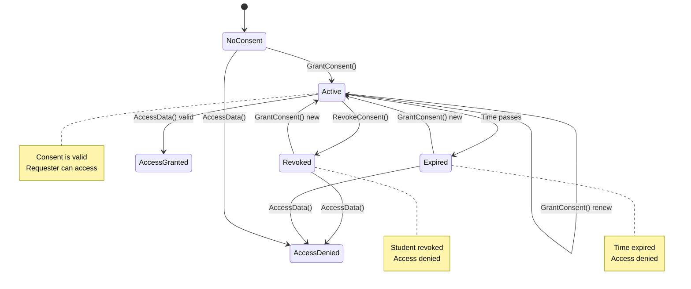
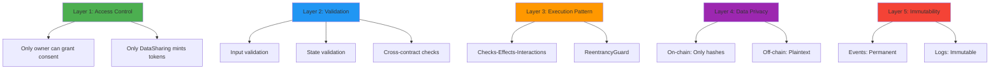
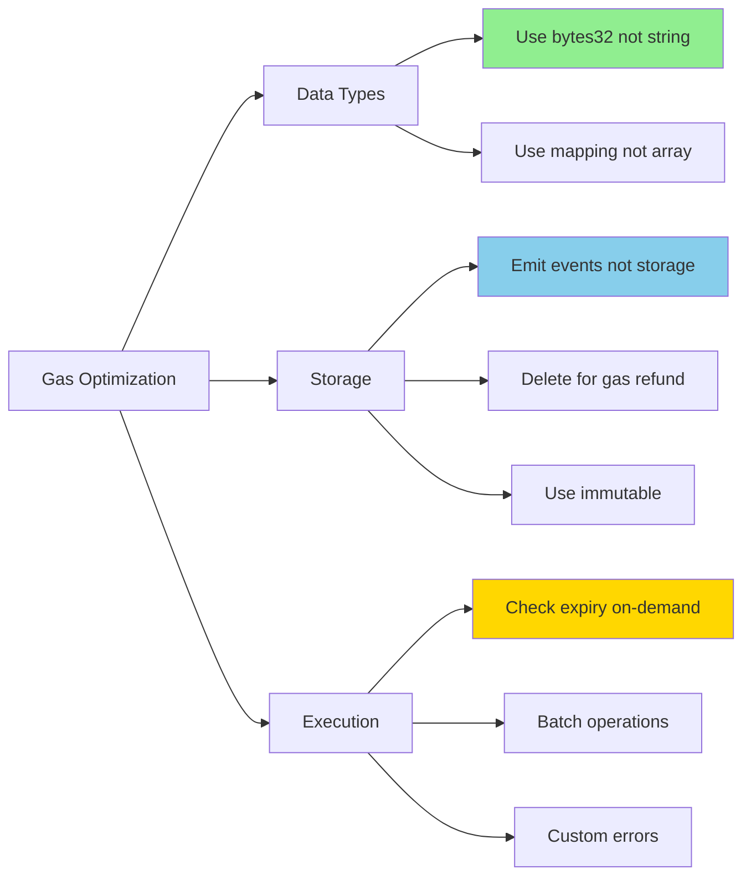
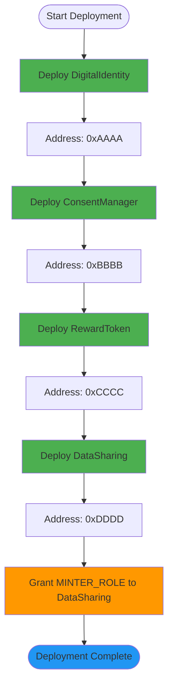
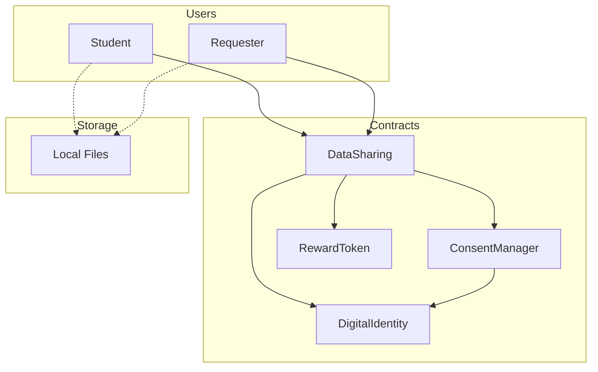

# System Architecture Diagrams

## 1. High-Level System Architecture

---

## 2. Contract Dependency Graph

**Deployment Order**:
1. Deploy `DigitalIdentity` first
2. Deploy `ConsentManager` (pass DigitalIdentity address)
3. Deploy `RewardToken` (independent)
4. Deploy `DataSharing` (pass all 3 addresses)
5. Grant `MINTER_ROLE` to DataSharing on RewardToken

---

## 3. Contract Interaction Flow

---

## 4. Data Flow: On-Chain vs Off-Chain

---

## 5. Smart Contract Class Diagram

---

## 6. Consent State Machine

---

## 7. Security Architecture Layers

---

## 8. Gas Optimization Strategy

---

## 9. Deployment Flow

---

## 10. Complete System Overview

---

## Summary

All diagrams use **Mermaid syntax** that should render in:
- GitHub
- VSCode (with Markdown Preview Mermaid Support extension)
- GitLab
- Many markdown viewers

If not rendering, install the **Markdown Preview Mermaid Support** extension in VSCode.