# Consent Workflow Diagrams

## 1. Grant Consent Flow

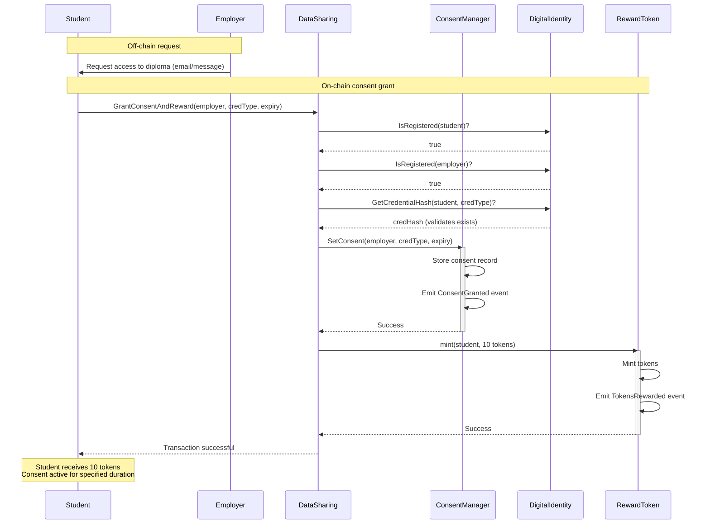

---

## 2. Revoke Consent Flow

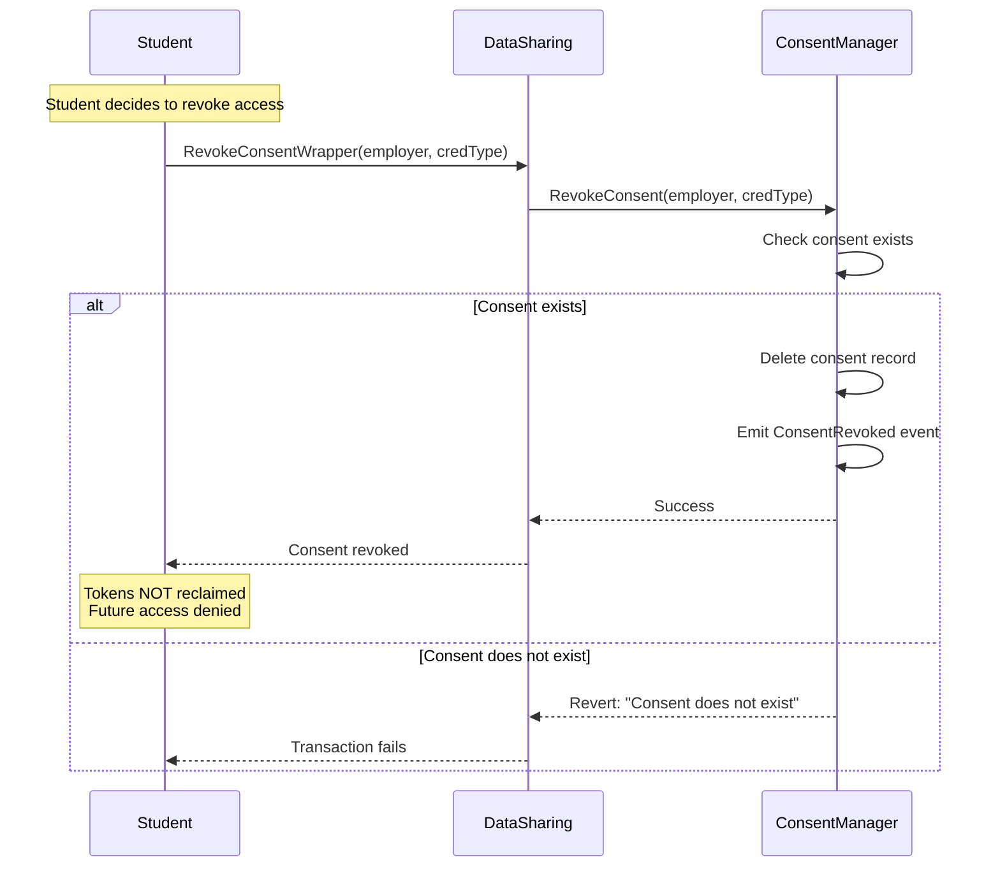

---

## 3. Consent Lifecycle State Machine

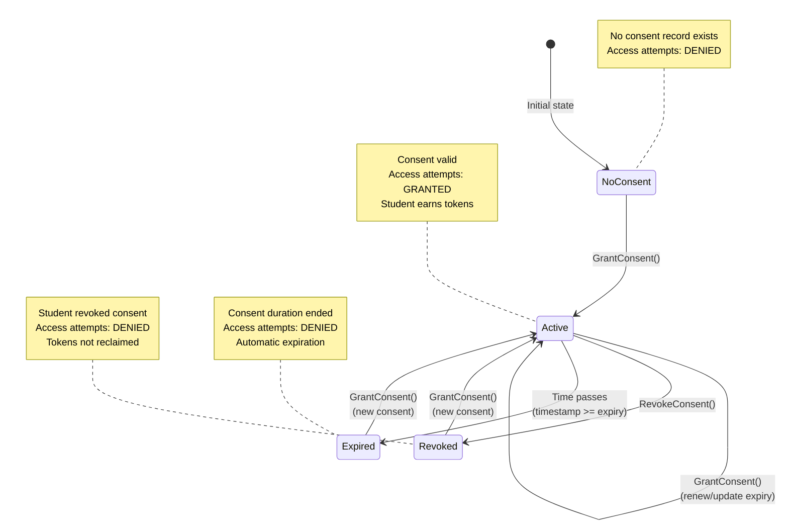

---

## 4. Consent Grant Decision Tree

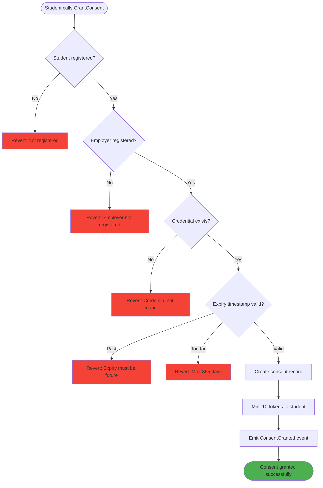

---

## 5. Consent Expiration Timeline

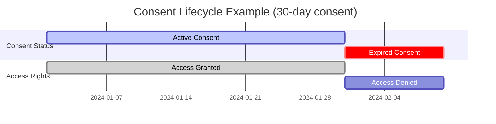

---

## 6. Consent Renewal Flow

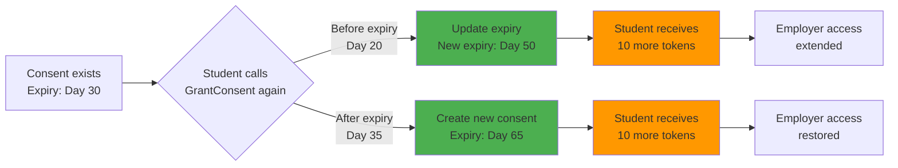

---

## 7. Multiple Consent Management

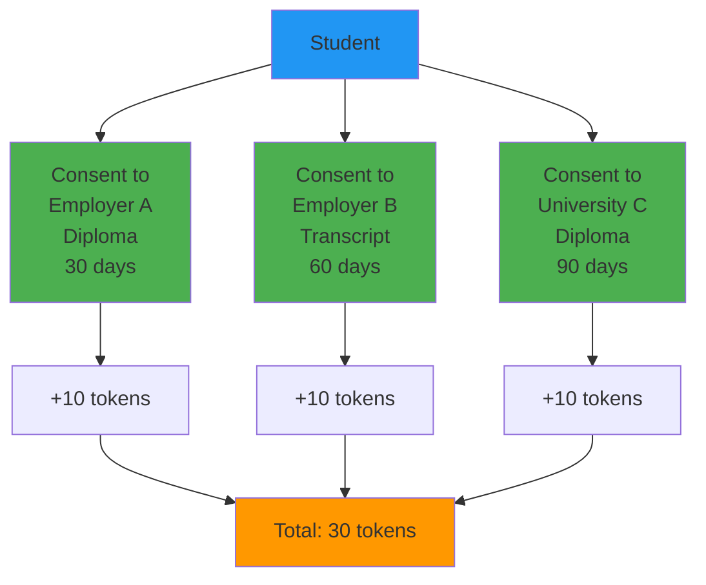

**Key Point**: Each consent is independent. Student can:
- Grant different credentials to different requesters
- Set different expiry times for each
- Earn tokens for each consent grant
- Revoke any consent independently

---

## 8. Consent Validation Checks

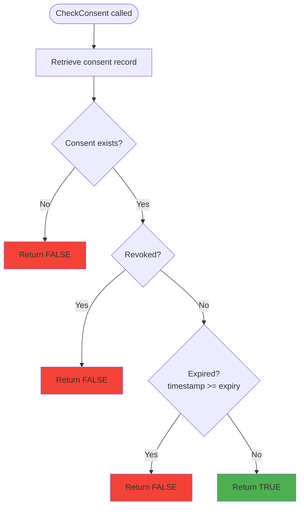

---

## 9. Edge Cases Handling

### Case 1: Granting consent to self

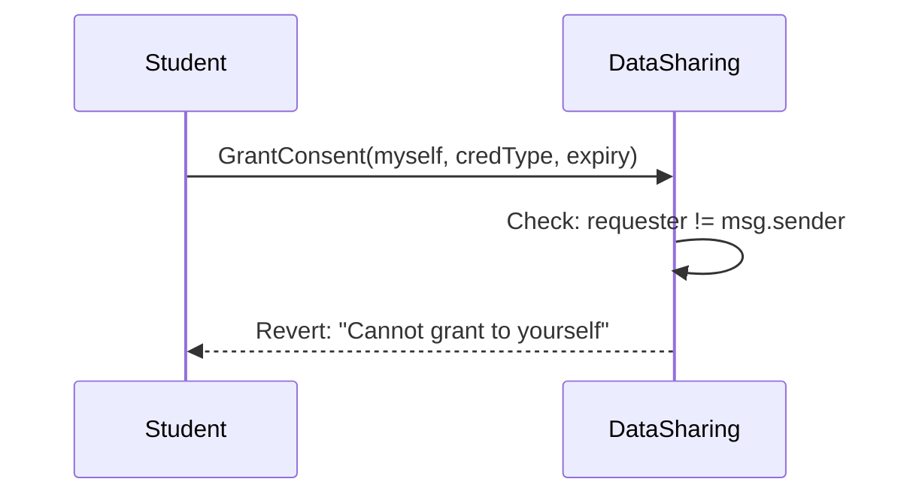

### Case 2: Duplicate consent (overwrite)

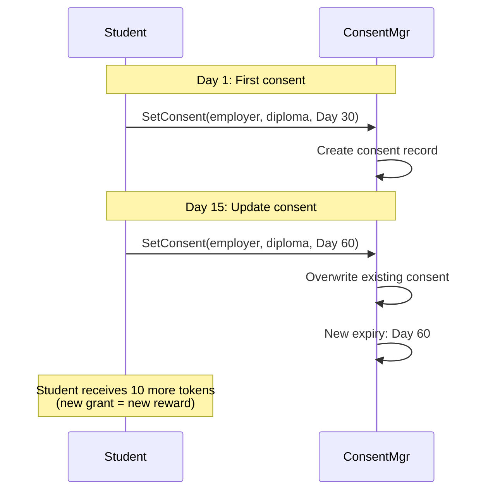

### Case 3: Revoking non-existent consent

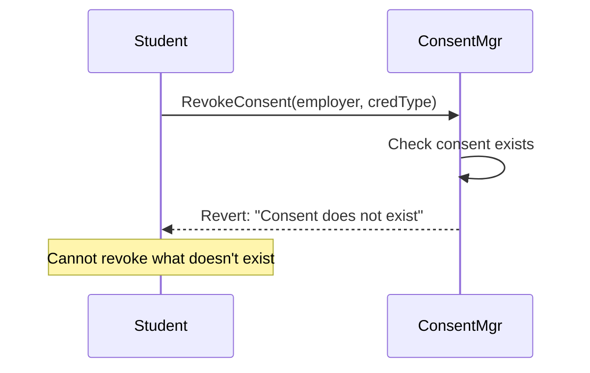

---

## 10. Consent Data Structure

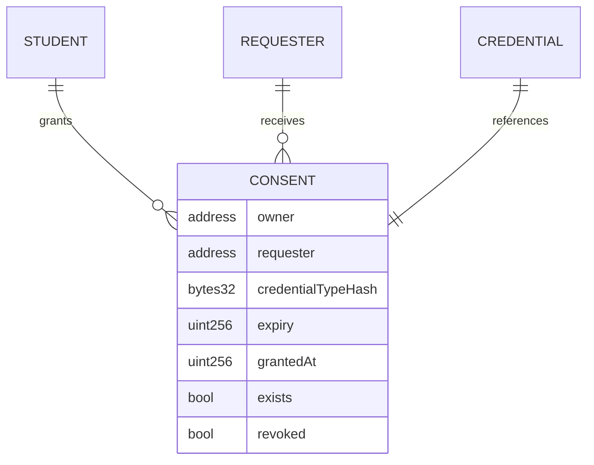

**Mapping Structure**:
```
mapping(
    address owner =>
    mapping(
        address requester =>
        mapping(
            bytes32 credentialType => Consent
        )
    )
) consents;
```

---

## Summary: Consent Workflow Key Points

**Grant Consent**:
- Student controls who accesses what
- Time-limited (1-365 days)
- Earns 10 tokens per grant
- Can update/renew anytime

**Revoke Consent**:
- Immediate effect
- Tokens not reclaimed
- Past logs remain

**Expiration**:
- Automatic (timestamp-based)
- No gas cost for expiration
- Can renew after expiry

**Security**:
- Only owner can grant/revoke
- Cross-contract validation
- Immutable audit trail
